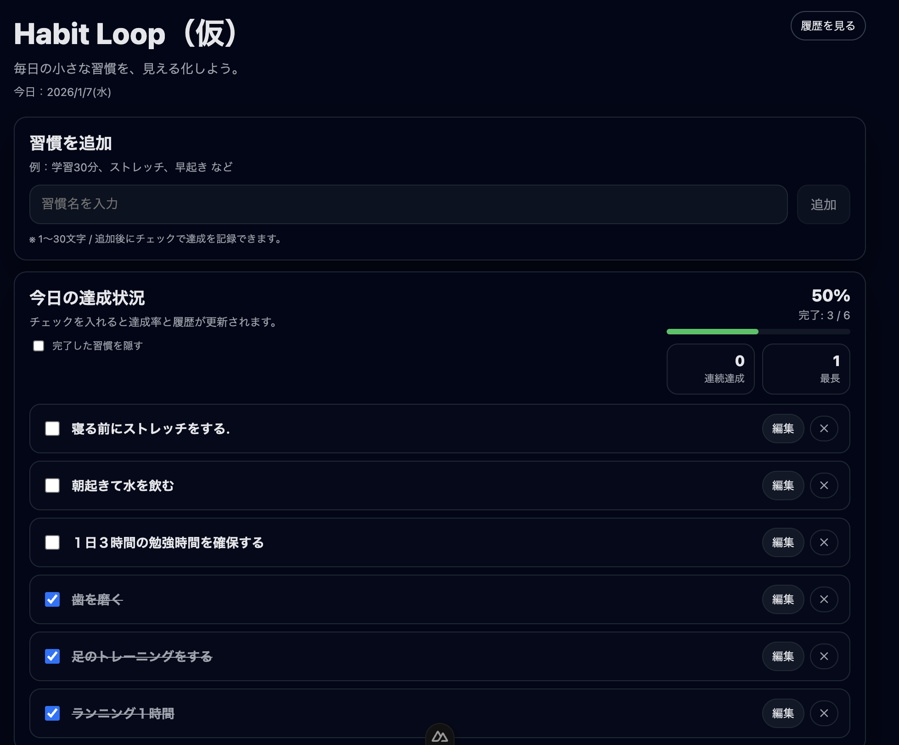
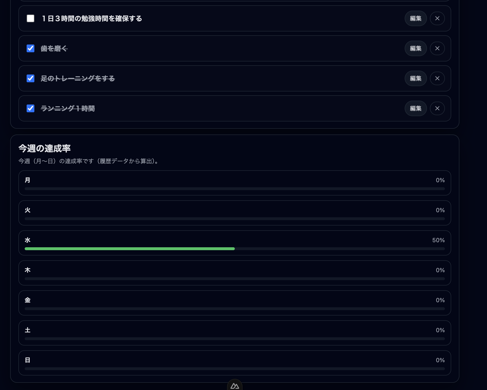
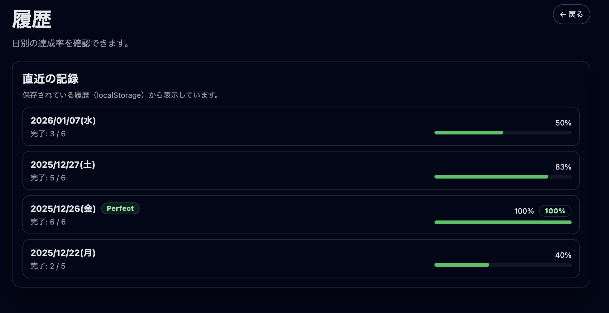

# Habit Loop（仮）

日々の習慣（学習・運動・早起きなど）を登録し、**今日の達成状況**や**週間の達成率**、**日別の履歴**を確認できる個人向けのシンプルな習慣トラッカーです。  
フロントエンド（Nuxt + TypeScript）での実装力を高める目的で制作しています。

---

## デモ

- 現状：ローカル実行（APIなし / localStorageで完結）
- デプロイ：未実施（必要に応じて対応予定）

---

## 主な機能

### Home（ダッシュボード）
- 習慣の追加（1〜30文字）
- 習慣の編集 / 削除
- 今日の達成チェック（ON/OFF）
- 今日の達成率表示
  - 完了数（例：完了 3 / 6）
  - 達成率（%）
  - プログレスバー
- 完了した習慣を隠す（表示切替）
- 連続達成（current） / 最長（best）を表示
- 今週（月〜日）の達成率を表示（履歴データから算出）

### History（履歴）
- 直近の記録を一覧表示（最大30日）
- 日別の達成率表示（% / 完了数 / バー）
- 100%達成の日は「Perfect」バッジを表示

---

## 画面イメージ

### Home（ダッシュボード）
#### 習慣追加＋今日の達成状況


#### 今週の達成率


### History（履歴）
#### Perfect表示



## 技術スタック

- Nuxt: **4.2.2**
- Vue: **3.5.25**
- TypeScript
- Pinia: **3.0.4**
- @pinia/nuxt: **0.11.3**
- データ永続化：**localStorage（APIなし）**

## セットアップ / 起動方法

> Node.js は **LTS（例：20系）** 推奨（環境に合わせてOK）

```bash
# install
npm install

# 開発サーバー
npm run dev

# 本番ビルド
npm run build

# ビルド後のプレビュー
npm run preview

# 静的生成（必要に応じて）
npm run generate
```
## 使い方

1. Homeで習慣を追加
2. チェックで達成をON/OFF
3. 右上の「履歴を見る」から History へ遷移
4. 100%達成の日は Perfect バッジが表示されます

## データ保存仕様（localStorage）

### 保存キー
- 習慣データ：`habit-loop:habits`
- 履歴データ：`habit-loop:history`（内部的にストアが扱います）

### 挙動（ロールオーバー）
- 日付が変わったタイミングで前日分を履歴として確定し、当日の `done` をリセットします
- 履歴は肥大化防止のため **直近90日分**に制限しています

### streak（連続達成）の定義
- 「その日の習慣が **100%達成（total > 0 かつ done >= total）**」で1日としてカウント
- `current`：今日から遡って連続している日数
- `best`：履歴全体での最長連続日数

## ディレクトリ構成（抜粋）

- `app/pages/index.vue`：Home（ダッシュボード）
- `app/pages/history.vue`：履歴ページ
- `app/stores/habitLoop.ts`：状態管理（Pinia）/ localStorage / 集計ロジック

## 今後の改善案（予定）

- スマホ表示の最適化
- 直近◯日グラフ（棒/折れ線など）の追加
- 習慣の並び替え（ドラッグ&ドロップ）
- エクスポート / インポート（JSON）
- PWA対応（オフライン/ホーム追加）

## ライセンス

- 未設定（必要に応じて MIT などを追加予定）
